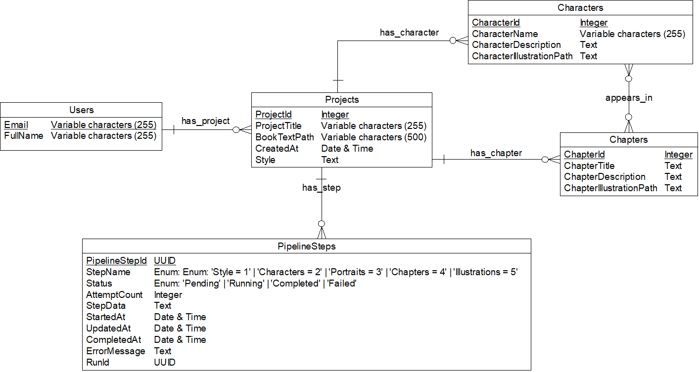

# Book Illustration

A web app that turns a book's text into character portraits and a chapter illustration, using the Gemini API.

## Prerequisites

Before running the project locally, install:

- [.NET SDK 9.0](https://dotnet.microsoft.com/download/dotnet/9.0)
- [Node.js 20.9.0 or later](https://nodejs.org/)
- pnpm 11.5.2

Install the frontend dependencies:

```sh
cd frontend
pnpm install
```

The application also requires:

- A Gemini API key.
- A JWT signing key with at least 32 bytes.

### Environment configuration

Create a local `.env` file from the provided template.

Windows PowerShell:

```powershell
Copy-Item .env.example .env
```

macOS/Linux:

```sh
cp .env.example .env
```

Then fill in:

```env
GEMINI_API_KEY=your_gemini_api_key
JWT_SIGNING_KEY=your_jwt_signing_key_with_at_least_32_bytes
```

## Run locally

Windows PowerShell:

```powershell
powershell -ExecutionPolicy Bypass -File .\start.ps1
```

macOS/Linux:

```sh
chmod +x start.sh
./start.sh
```

## Run tests

Windows PowerShell:

```powershell
powershell -ExecutionPolicy Bypass -File .\test.ps1
```

macOS/Linux:

```sh
chmod +x test.sh
./test.sh
```

## Architecture Overview

The application uses a client-server architecture.

```text
┌──────────────────────────────────────────┐
│ Frontend — Next.js                       │
│ • Complete user interface                │
└────────────────────┬─────────────────────┘
                     │ HTTP requests
                     │ + JWT cookie
                     ▼
┌──────────────────────────────────────────┐
│ Backend — ASP.NET Core                   │
│ • Application logic                     │
│ • Illustration generation workflow      │
│                                          │
│ ├── Authentication & project APIs       │
│ ├── Pipeline services                   │
│ │   Style → Characters → Portraits      │
│ │   → Chapters → Illustrations          │
│ ├── Gemini Interactions API client      │
│ ├── SQLite database                     │
│ └── Local file storage                  │
│     ├── AppData/Books                    │
│     └── AppData/Illustrations            │
└────────────────────┬─────────────────────┘
                     │
                     │ REST API requests
                     ▼
┌──────────────────────────────────────────┐
│ Gemini Interactions API                  │
│ • Generates descriptions                │
│ • Generates illustrations               │
└──────────────────────────────────────────┘
```


## Conceptual Data Model



## Additional Notes

- `AGENTS.md`: Defines the rules the agent must follow when collaborating with the author.
- `HARNESS.md`: Describes the verification process to run after each code change.
- `backend/AppData/`: Local runtime storage for the SQLite database, uploaded book text files, and generated illustrations. This directory is ignored by Git.
- `backend/BookIllustration_Backend.Tests/`: Integration tests for the pipeline APIs. Each test creates and seeds its own temporary SQLite database and files, then removes them after completion.

Gemini REST API requests are based on the [Interactions API overview](https://ai.google.dev/gemini-api/docs/interactions-overview).
